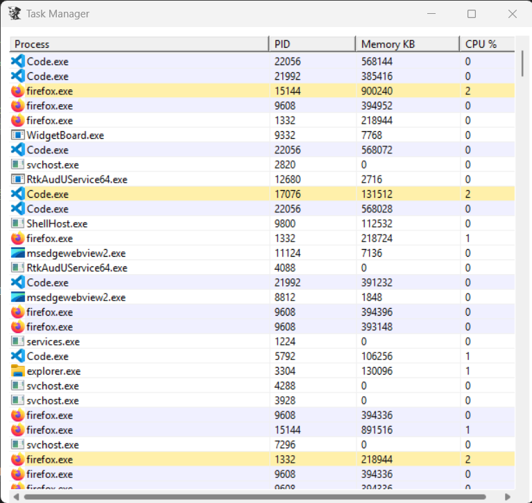

[in progress]

## Task Manager

A lightweight Windows Task Manager–like application written in C++ using the WinAPI.
This project was created for learning purposes and demonstrates core Windows programming concepts.



# Features

- Lists all running processes
- CPU usage (%)
- Live refresh every ~1.5 seconds
- Clickable column headers for sorting
- Process icons (with fallback default icon)
- Row coloring based on:
  - CPU usage
  - Memory usage
- Logs high CPU or memory processes to a file (logs.txt)

# Build Instructions

Compile the rc file:
```
windres resources.rc -O coff -o resources.o
```
Compile main:
```
g++ main.cpp resources.o -mwindows -lcomctl32 -lpsapi -lshell32 -o taskMngr.exe
```
Run:
```
./taskMngr.exe
```
